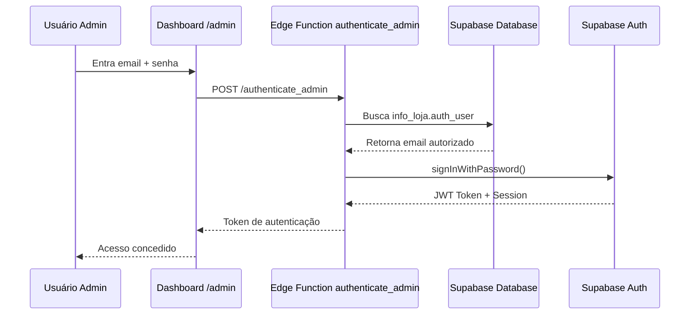

# 🔒 DOCUMENTAÇÃO DE SEGURANÇA - Sistema de Agendamentos ASPERUS

## 📋 Índice

1. [Visão Geral da Arquitetura](#visão-geral-da-arquitetura)
2. [Modelo de Autenticação](#modelo-de-autenticação)
3. [Row Level Security (RLS)](#row-level-security-rls)
4. [Proteção de Dados Pessoais](#proteção-de-dados-pessoais)
5. [Edge Functions e Service Role](#edge-functions-e-service-role)
6. [Políticas por Tabela](#políticas-por-tabela)
7. [Boas Práticas](#boas-práticas)
8. [Auditoria e Monitoramento](#auditoria-e-monitoramento)

---

## 🏗️ Visão Geral da Arquitetura

### Camadas de Segurança

```
┌─────────────────────────────────────────┐
│         USUÁRIOS PÚBLICOS (anon)        │
│  - Podem agendar (via Edge Functions)   │
│  - Podem consultar disponibilidade      │
│  - NÃO veem dados pessoais de outros    │
└─────────────────────────────────────────┘
                    ↓
┌─────────────────────────────────────────┐
│      EDGE FUNCTIONS (service_role)      │
│  - Validam dados antes de inserir       │
│  - Geram senhas de confirmação          │
│  - Verificam conflitos de horários      │
│  - Bypass RLS para operações seguras    │
└─────────────────────────────────────────┘
                    ↓
┌─────────────────────────────────────────┐
│   SUPABASE DATABASE (Row Level Security)│
│  - RLS ativo em TODAS as tabelas        │
│  - Políticas específicas por papel      │
│  - Dados pessoais protegidos            │
└─────────────────────────────────────────┘
                    ↑
┌─────────────────────────────────────────┐
│    ADMINISTRADOR (authenticated)        │
│  - Acesso ao dashboard administrativo   │
│  - Visualiza todos os agendamentos      │
│  - Gerencia configurações da loja       │
└─────────────────────────────────────────┘
```

---

## 🔐 Modelo de Autenticação

### Dois Tipos de Usuários

#### 1️⃣ **Usuários Públicos (anon)**
- **Acesso**: Através do site público
- **Permissões**: 
  - ✅ Criar agendamentos (via `book_slot`)
  - ✅ Consultar agendamentos próprios (com senha)
  - ✅ Cancelar agendamentos próprios (com senha)
  - ✅ Reagendar agendamentos próprios (com senha)
  - ✅ Ver horários disponíveis
  - ✅ Ver feriados
  - ❌ **NÃO** acessam dados pessoais de outros usuários
  - ❌ **NÃO** acessam o banco de dados diretamente

#### 2️⃣ **Administrador (authenticated)**
- **Acesso**: Dashboard admin (`/admin`)
- **Autenticação**: Email/senha via Supabase Auth
- **Permissões**:
  - ✅ Visualizar TODOS os agendamentos
  - ✅ Visualizar cadastros de clientes
  - ✅ Gerenciar configurações da loja
  - ✅ Adicionar/remover feriados
  - ❌ **NÃO** pode modificar agendamentos diretamente (usa Edge Functions)

### Fluxo de Autenticação Admin



---

## 🛡️ Row Level Security (RLS)

### O Que É RLS?

**Row Level Security (RLS)** é um recurso do PostgreSQL que:
- Filtra automaticamente linhas de tabelas baseado em políticas
- Aplica regras ANTES de retornar dados
- Funciona mesmo se alguém tiver acesso direto ao SQL
- É **impossível de bypassar** sem as credenciais corretas

### Por Que RLS é Crítico?

Mesmo que alguém:
- ❌ Tenha a API Key pública (`anon`)
- ❌ Tente fazer queries SQL diretas
- ❌ Use ferramentas como Postman

**Eles NÃO conseguirão ver dados protegidos** porque o PostgreSQL bloqueia no nível do banco!

---

## 🔒 Proteção de Dados Pessoais

### Dados Sensíveis Protegidos

A tabela `agendamentos_robustos` contém:

| Campo | Sensibilidade | Proteção |
|-------|---------------|----------|
| `NOME` | 🔴 **ALTA** | Invisível para `anon` |
| `CONTATO` | 🔴 **ALTA** | Invisível para `anon` |
| `senha` | 🔴 **CRÍTICA** | Invisível para `anon` |
| `DATA` | 🟡 Média | Visível apenas via Edge Functions |
| `HORA` | 🟡 Média | Visível apenas via Edge Functions |
| `PROFISSIONAL` | 🟢 Baixa | Necessário para booking |
| `servico` | 🟢 Baixa | Necessário para booking |

### Como Usuários Acessam Seus Dados?

**Via Edge Function `query_bookings`**:
1. Cliente fornece: `CONTATO` + `senha`
2. Edge Function valida credenciais
3. Retorna APENAS agendamentos daquele contato
4. **Nunca** expõe dados de outros usuários

```typescript
// Edge Function query_bookings (validação de senha)
const validBookings = data.filter(booking => 
  senha === booking.senha && // Validação de senha
  booking.CONTATO === contact // Apenas do próprio usuário
);
```

---

## ⚡ Edge Functions e Service Role

### Por Que Edge Functions Usam `service_role`?

**Service Role** é necessário porque:
- ✅ Precisa **inserir** novos agendamentos
- ✅ Precisa **atualizar** status (cancelar, reagendar)
- ✅ Precisa **verificar conflitos** de horários
- ✅ Precisa **gerar senhas** seguras

### Validações de Segurança nas Edge Functions

Todas as Edge Functions implementam:

#### 1️⃣ **Validação de Entrada**
```typescript
if (!date || !time || !name || !contact || !professional || !service) {
  return Response 400 // Bad Request
}
```

#### 2️⃣ **Verificação de Conflitos**
```typescript
const { data: conflicts } = await supabase
  .from("agendamentos_robustos")
  .eq("DATA", date)
  .eq("HORA", time)
  .eq("PROFISSIONAL", professional)
  .in("STATUS", ["AGENDADO"]);

if (conflicts.length > 0) {
  return Response 409 // Conflict
}
```

#### 3️⃣ **Verificação de Feriados**
```typescript
const { data: feriado } = await supabase
  .from("feriados")
  .eq("data", date)
  .maybeSingle();

if (feriado) {
  return Response 400 // Não pode agendar em feriado
}
```

#### 4️⃣ **Geração de Senha Segura**
```typescript
// Utility compartilhada
export function generatePassword(length = 4): string {
  const chars = '0123456789ABCDEFGHIJKLMNOPQRSTUVWXYZ';
  return Array.from(
    { length }, 
    () => chars[Math.floor(Math.random() * chars.length)]
  ).join('');
}
```

---

## 📊 Políticas por Tabela

### 1. `agendamentos_robustos`

```sql
-- ❌ anon: SEM ACESSO DIRETO
-- Usuários públicos só acessam via Edge Functions

-- ✅ service_role: FULL ACCESS
CREATE POLICY "Service role can insert appointments"
ON agendamentos_robustos FOR INSERT TO service_role
WITH CHECK (true);

CREATE POLICY "Service role can update appointments"
ON agendamentos_robustos FOR UPDATE TO service_role
USING (true) WITH CHECK (true);

CREATE POLICY "Service role can delete appointments"
ON agendamentos_robustos FOR DELETE TO service_role
USING (true);

-- ✅ authenticated: READ ONLY
CREATE POLICY "Authenticated users can read all appointments"
ON agendamentos_robustos FOR SELECT TO authenticated
USING (true);
```

**Por quê?**
- 🔒 Protege NOME, CONTATO, senha de acesso público
- ✅ Admin vê tudo no dashboard
- ✅ Edge Functions gerenciam operações com validação

---

### 2. `cadastro`

```sql
-- ❌ anon: SEM ACESSO
-- Cadastros são criados automaticamente pelas Edge Functions

-- ✅ service_role: FULL ACCESS
CREATE POLICY "Service role full access to cadastro"
ON cadastro FOR ALL TO service_role
USING (true) WITH CHECK (true);

-- ✅ authenticated: READ ONLY
CREATE POLICY "Authenticated users can read all cadastros"
ON cadastro FOR SELECT TO authenticated
USING (true);
```

**Por quê?**
- 🔒 Dados cadastrais são sensíveis
- ✅ Admin pode ver histórico de clientes
- ✅ Edge Functions atualizam automaticamente no agendamento

---

### 3. `feriados`

```sql
-- ✅ anon + authenticated: READ
CREATE POLICY "Public can read feriados"
ON feriados FOR SELECT TO anon, authenticated
USING (true);

-- ✅ service_role: FULL ACCESS
CREATE POLICY "Service role full access to feriados"
ON feriados FOR ALL TO service_role
USING (true) WITH CHECK (true);
```

**Por quê?**
- 📅 Necessário para verificar disponibilidade pública
- ✅ Não contém dados sensíveis
- ✅ Admin gerencia via dashboard

---

### 4. `info_loja`

```sql
-- ✅ anon + authenticated: READ
CREATE POLICY "Public can read info_loja"
ON info_loja FOR SELECT TO anon, authenticated
USING (true);

-- ✅ service_role: FULL ACCESS
CREATE POLICY "Service role can read info_loja"
ON info_loja FOR SELECT TO service_role
USING (true);

-- ... mais policies para INSERT/UPDATE/DELETE
```

**Por quê?**
- 🏪 Informações públicas (nome, endereço, horários)
- 🔑 **CRÍTICO**: Service role precisa ler `auth_user` para autenticação admin
- ✅ Admin atualiza via dashboard

---

### 5. `bd_ativo`

```sql
-- ❌ anon: SEM ACESSO
-- Tabela de controle interno do sistema

-- ✅ service_role: FULL ACCESS
CREATE POLICY "Service role full access to bd_ativo"
ON bd_ativo FOR ALL TO service_role
USING (true) WITH CHECK (true);
```

**Por quê?**
- ⚙️ Controle interno do sistema
- 🔒 Não deve ser acessível publicamente

---

## ✅ Boas Práticas

### Para Desenvolvedores

#### 1️⃣ **NUNCA exponha Service Role Key**
```bash
# ❌ ERRADO - Nunca faça isso
const supabase = createClient(url, SERVICE_ROLE_KEY); // No frontend!

# ✅ CORRETO - Apenas em Edge Functions
const supabase = createClient(
  Deno.env.get("SUPABASE_URL"),
  Deno.env.get("SUPABASE_SERVICE_ROLE_KEY")
);
```

#### 2️⃣ **Sempre valide entrada nas Edge Functions**
```typescript
// ✅ SEMPRE faça isso
if (!date || !time || !name || !contact) {
  return new Response(
    JSON.stringify({ error: "Campos obrigatórios faltando" }), 
    { status: 400 }
  );
}
```

#### 3️⃣ **Use utilities compartilhadas**
```typescript
// ✅ Centralizado em _shared/utils.ts
import { generatePassword, getBrazilDateTime, corsHeaders } from '../_shared/utils.ts';

// ❌ Não duplique código
function generatePassword() { ... } // Duplicação!
```

#### 4️⃣ **Sempre use RLS em novas tabelas**
```sql
-- ✅ SEMPRE ative RLS
ALTER TABLE nova_tabela ENABLE ROW LEVEL SECURITY;

-- E crie policies apropriadas
CREATE POLICY "..." ON nova_tabela ...
```

---

### Para Administradores

#### 1️⃣ **Mantenha GitHub Secrets seguros**
- `SUPABASE_ACCESS_TOKEN`: Nunca compartilhe
- `SUPABASE_PROJECT_ID`: Pode ser público, mas prefira secret
- Rotacione tokens periodicamente

#### 2️⃣ **Monitore logs das Edge Functions**
```bash
# Ver logs em tempo real
supabase functions logs book_slot --project-ref SEU_PROJECT_ID

# Procure por:
# - Tentativas de acesso não autorizado
# - Erros de validação frequentes
# - Padrões suspeitos de requisições
```

#### 3️⃣ **Audite permissões regularmente**
```sql
-- Verificar todas as policies ativas
SELECT schemaname, tablename, policyname, roles, cmd
FROM pg_policies
WHERE schemaname = 'public';

-- Verificar RLS ativo
SELECT tablename, rowsecurity 
FROM pg_tables 
WHERE schemaname = 'public';
```

#### 4️⃣ **Backup de dados sensíveis**
- Configure backups automáticos no Supabase Dashboard
- Teste restauração periodicamente
- Mantenha backups em múltiplas regiões

---

## 📊 Auditoria e Monitoramento

### Logs Importantes

#### Edge Functions
```typescript
// Sempre logue operações críticas
console.log('Agendamento criado:', { 
  id: booking.id, 
  data: booking.DATA, 
  profissional: booking.PROFISSIONAL 
});
// ⚠️ NUNCA logue: senha, contato completo, dados pessoais
```

#### Monitoramento de Tentativas de Acesso
```sql
-- Criar trigger de auditoria (opcional)
CREATE TABLE audit_log (
  id UUID PRIMARY KEY DEFAULT gen_random_uuid(),
  table_name TEXT,
  action TEXT,
  user_id UUID,
  timestamp TIMESTAMPTZ DEFAULT NOW(),
  details JSONB
);

-- Trigger para auditar mudanças
CREATE OR REPLACE FUNCTION audit_trigger_func()
RETURNS TRIGGER AS $$
BEGIN
  INSERT INTO audit_log (table_name, action, details)
  VALUES (TG_TABLE_NAME, TG_OP, row_to_json(NEW));
  RETURN NEW;
END;
$$ LANGUAGE plpgsql;
```

### Métricas de Segurança

Monitore:
- ✅ Taxa de falha em autenticações admin
- ✅ Tentativas de acesso com senhas inválidas
- ✅ Horários com mais conflitos (possível ataque?)
- ✅ Requisições anormalmente frequentes de um IP

---

## 🚨 Resposta a Incidentes

### Se Suspeitar de Violação de Segurança

1. **Rotacione imediatamente**:
   - Service Role Key (Supabase Dashboard > Settings > API)
   - Anon Key (se comprometida)
   - Senhas de admin

2. **Revise logs**:
```bash
supabase functions logs --project-ref SEU_PROJECT_ID --all
```

3. **Audite políticas RLS**:
```sql
-- Verificar se RLS está ativo
SELECT tablename, rowsecurity FROM pg_tables WHERE schemaname = 'public';
```

4. **Notifique usuários afetados** (se dados foram expostos)

5. **Atualize documentação** com lições aprendidas

---

## 📞 Contato

Para questões de segurança críticas:
- **Email do Admin**: Configurado em `info_loja.auth_user`
- **Supabase Support**: https://supabase.com/support
- **GitHub Issues**: Para reportar vulnerabilidades privadamente

---

## 📜 Histórico de Mudanças

| Data | Versão | Mudanças |
|------|--------|----------|
| 2025-10-27 | 1.0 | Documentação inicial completa |

---

## 📚 Recursos Adicionais

- [Supabase RLS Documentation](https://supabase.com/docs/guides/auth/row-level-security)
- [PostgreSQL RLS](https://www.postgresql.org/docs/current/ddl-rowsecurity.html)
- [Edge Functions Security](https://supabase.com/docs/guides/functions/auth)
- [OWASP Top 10](https://owasp.org/www-project-top-ten/)

---

**🔒 Mantenha este documento atualizado conforme o sistema evolui!**
